# executor service
This program makes it possible to test your website using Selenium WebDriver.
To do this, you simply need to create a test scenario and pass it via the API. 
Additionally, you can make the program use proxies that will be retrieved from a remote API and validated.
### Services
- [worker](https://github.com/victortarasov1/worker_microservice) - executes scenarios and generates reports.
- [publisher](https://github.com/victortarasov1/publisher_microservice) - provides an API to manage scenarios and reports
- [proxy](https://github.com/victortarasov1/proxy_microservice) - provides an API for retrieving and validating proxies from a remote API and saving them to a database,
  as well as for retrieving valid proxies from the database.
- [config](https://github.com/victortarasov1/executor-service-configuration) - is a centralised storage of services` configurations
- [config server](https://github.com/victortarasov1/configserver) - service for managing configurations.
- [eureka](https://github.com/victortarasov1/executor-service-eureka) - service registry
- [gateway server](https://github.com/victortarasov1/executor-service-gateway) - gateway
## API

- `PUT: /executor/publisher/scenario` - add new scenario
- `DELETE: /executor/publisher/scenario/?scenarioId=` - delete scenario by id
- `PATCH: /executor/publisher/scenario` - update scenario
- `POST: /executor/publisher/scenario/?scenarioId=` - execute scenario by id
- `GET: /executor/publisher/scenario/?scenarioId=` - get scenario by id
- `GET: /executor/publisher/scenario/all` - get all scenarios
- `GET: /executor/publisher/reports/?scenarioId=` - get report by id
- `GET: /executor/publisher/reports/all` - get all reports
- `POST: /executor/proxy/add` - load proxies from remote source
- `GET: /executor/proxy/get` - get proxy

Please note that access to all endpoints is restricted. To obtain it, you need to configure a keycloak (see below) and obtain a token.

## Json Examples

### Proxy Example
```json
{
  "id": "74ce8215-e6b0-4e43-9f5c-481fb3f40d42",
  "proxyNetworkConfig": {
    "id": "f89664ee-6286-4275-807d-d5ab0f85841d",
    "hostname": "45.65.137.218",
    "port": 999
  },
  "proxyCredentials": {
    "username": "",
    "password": ""
  },
  "createdAt": "2024-07-03T15:08:35.890147Z"
}
```
### Scenario Example

```json
 {
  "id": "6c933798-722b-4539-8544-5f9bb2fefc9f",
  "name": "linux scenario",
  "site": "https://kernel.org/",
  "steps": [
    {
      "id": "9d24893f-37d4-4f53-b7fa-0852516d39da",
      "action": "sleep",
      "value": "5000:8000",
      "createdAt": "2024-07-03T15:02:59.752771Z"
    },
    {
      "id": "cb437fb8-2069-46bc-9f87-1f1e72545f03",
      "action": "clickCss",
      "value": "#banner > nav > ulwww > li:nth-child(1) > a",
      "createdAt": "2024-07-03T15:02:59.754714Z"
    },
    {
      "id": "2a431e78-e8a6-4721-a006-d871b0226d0d",
      "action": "sleep",
      "value": "3000:5000",
      "createdAt": "2024-07-03T15:02:59.756483Z"
    },
    {
      "id": "ecfaa716-9204-4c44-8968-a922e7598544",
      "action": "clickXpath",
      "value": "/html/body/footer/address[2]/a[4]",
      "createdAt": "2024-07-03T15:02:59.758472Z"
    },
    {
      "id": "1630dce4-c8e2-4d9b-90d9-766b47e5599c",
      "action": "sleep",
      "value": "3000:5000",
      "createdAt": "2024-07-03T15:02:59.760070Z"
    }
  ],
  "createdAt": "2024-07-03T15:02:59.690204Z"
}
```

### Report Example
```json
 {
        "id": "0c7bf91b-9185-4ba8-9677-5d7718de003a",
        "scenarioId": "6c933798-722b-4539-8544-5f9bb2fefc9f",
        "startTime": "2024-07-03T15:03:51.33485",
        "endTime": "2024-07-03T15:03:53.226406",
        "errorMessage": "Failed to perform 'Sleep' step.",
        "webDriverInfo": "RemoteWebDriver: chrome on linux (ae6058186077e5f81c3495d248d0e5de)",
        "name": "linux scenario",
        "site": "https://kernel.org/",
        "stepReports": [
            {
                "id": "e46c11b3-f81a-4f8f-b5a6-46e162002b1a",
                "startTime": "15:03:53.223",
                "endTime": "15:03:53.226",
                "errorMessage": "Failed to perform 'Sleep' step.",
                "action": "sleep",
                "value": "8000:5000"
            }
        ]
    }
```
## RUN

- clone this repo.
- cd project-name/prod
- docker compose up -d
- (to stop project): docker compose down

You can view the application logs as well as metrics using Grafana.
(go to http://localhost:3000/)

## Configure Keycloak:
go to http://localhost:7080/

Log in(username/password: admin):
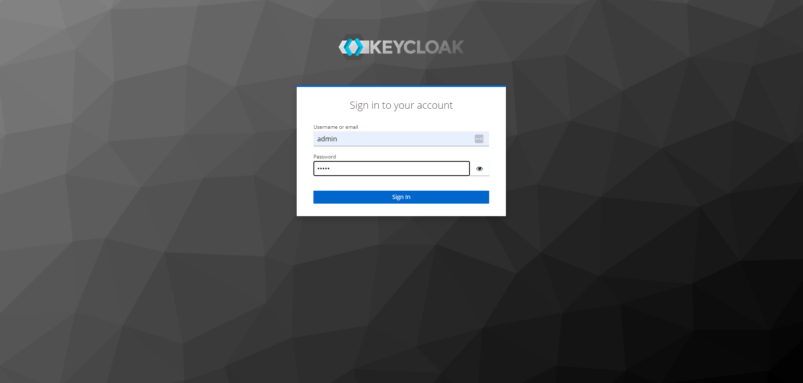

Create realm role USER:

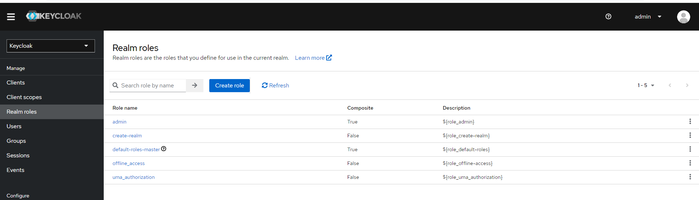
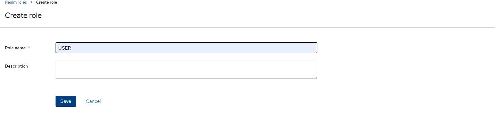

Create Client:
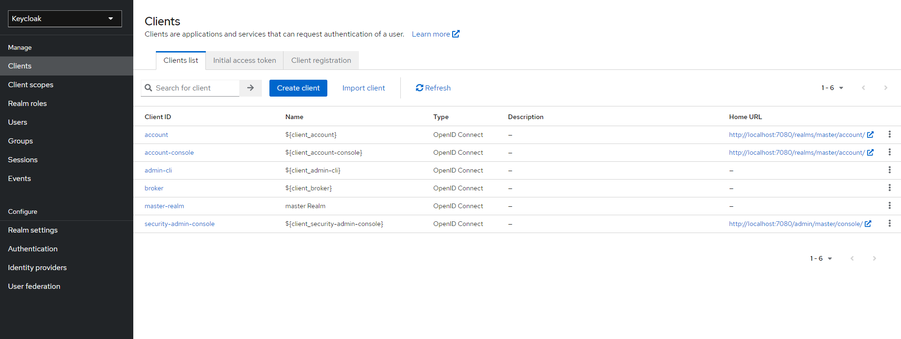
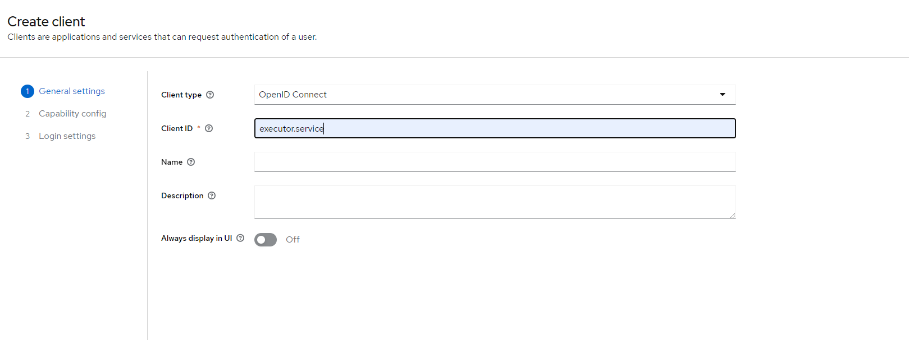
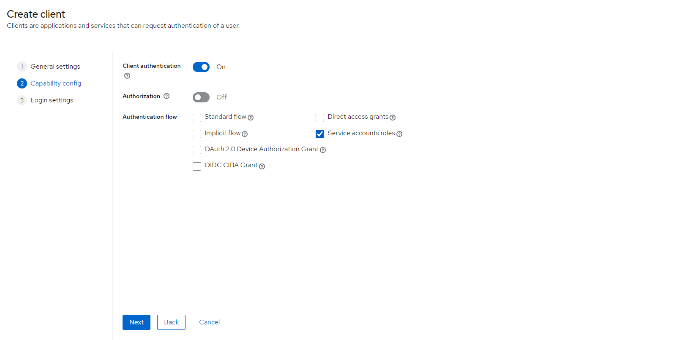

assign role to the client:
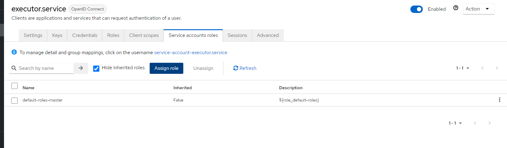
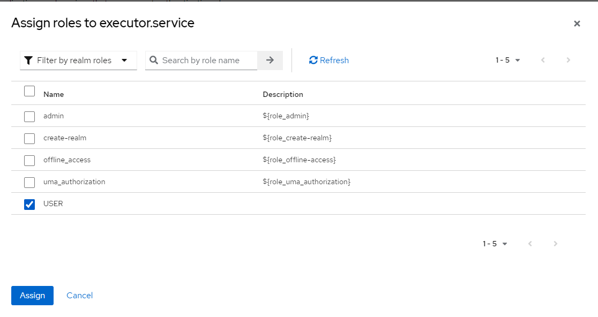

set password (client secret):
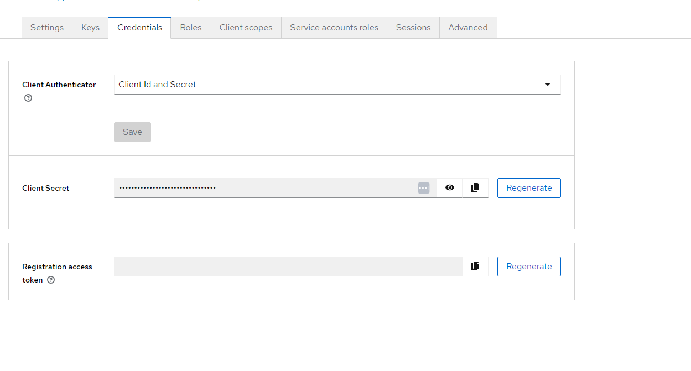

Now, when you have configured keycloak, you can gain access to the endpoints using such postman configuration:
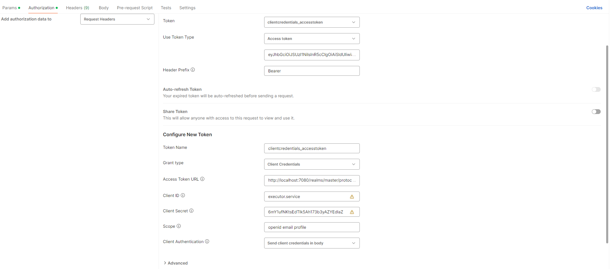
(also you can use postman collection from this repository, but please don't forget to set your password at the 'client secret' field)

## Used Technologies
### Back-end:
- Spring Web
- Spring Data JPA
- Spring Actuator
- Spring Cloud Config
- Spring Cloud Eureka
- Spring Cloud OpenFeign
- Spring Cloud Circuit breaker
- Spring Cloud Stream
- Spring Cloud Gateway
- okhttp
- Selenium
- prometheus
- Selenium
- Lombok
- Spring Boot
- AspectJ
- Mockito
- AssertJ

### Observability:
- Grafana
- Loki
- Prometheus
### Server build:
- gradle
- google jib


### Requirements:
- docker

## Flow
### Executing scenario and generation report flow:


### Loading proxies and validating from the remote API:
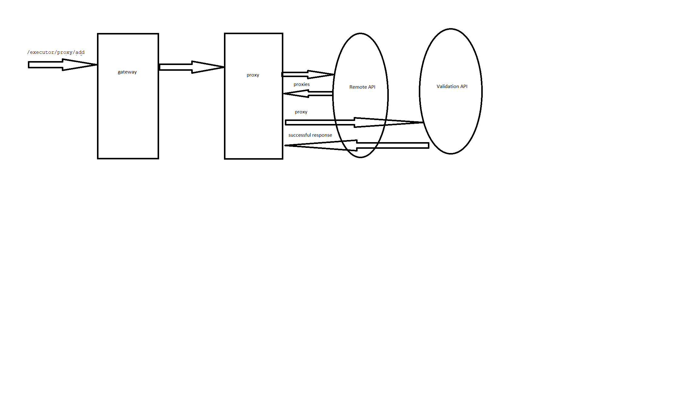